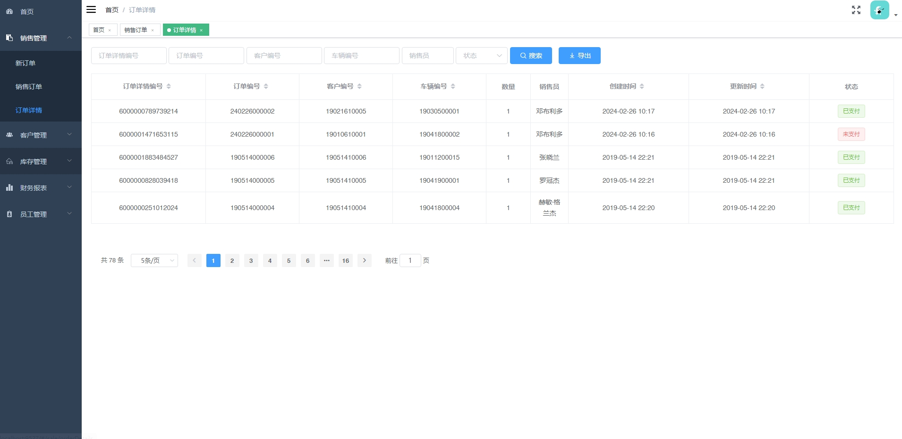
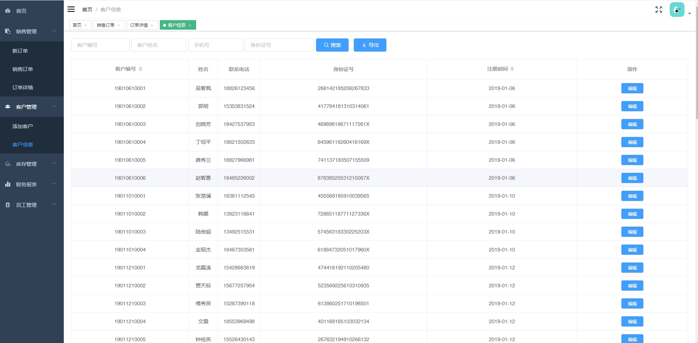
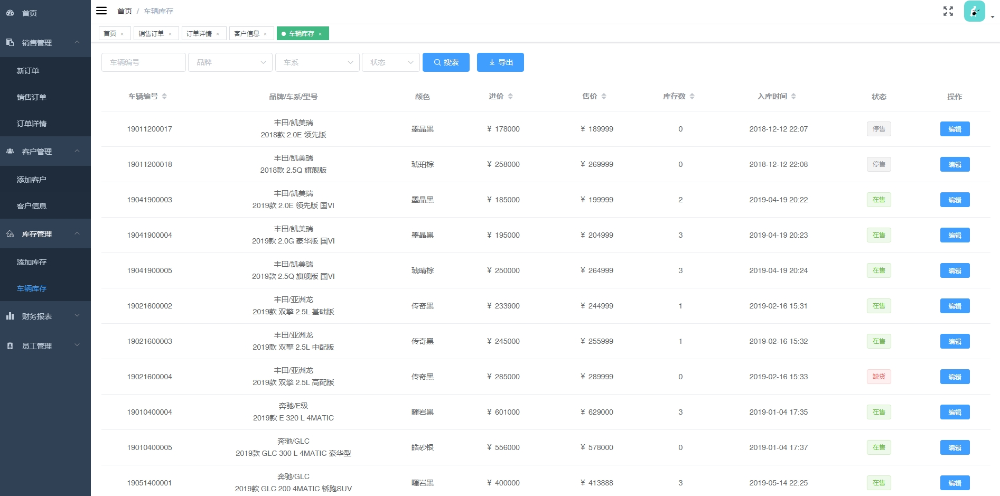
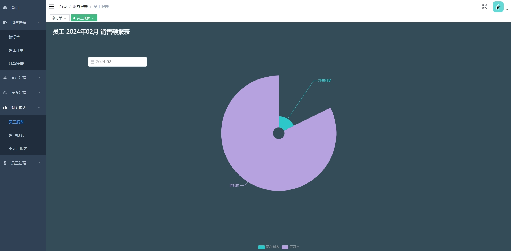
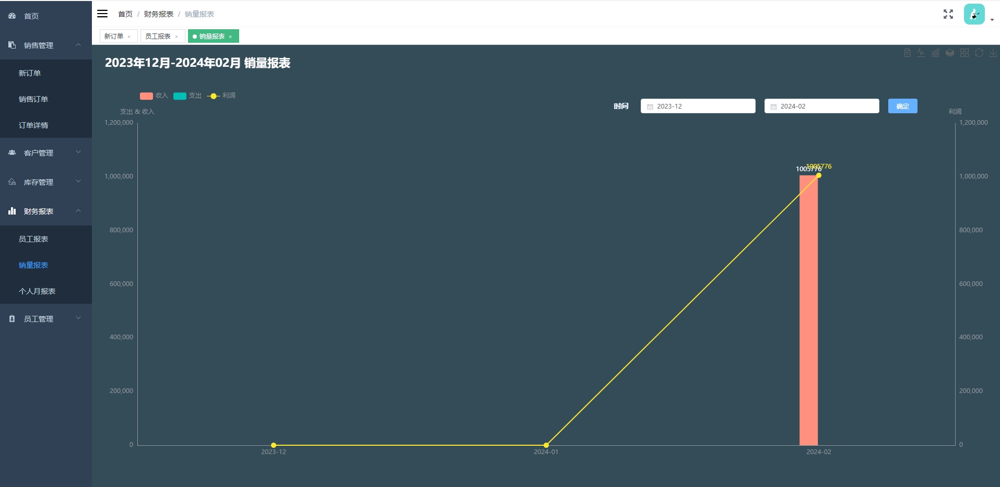

**郑重申明：代码经过本地测试，确保可以正常运行。项目仅供学习或毕业设计参考~**

#### 1.项目介绍
基于spring boot以及Vue开发，针对汽车销售提供客户信息、车辆信息、订单信息、销售人员管理、财务报表等功能，提供经理和销售两种角色进行管理。
技术框架：springboot + mybatis + Mysql5.7 + vue2 + npm + node
运行环境：jdk8 + IntelliJ IDEA + maven

#### 2.项目部署
##### 2.1 后端部署

- 创建数据库，导入项目中sql文件
- 打开idea，导入项目car-sales/carsale-master
- 根本本地数据库环境，修改配置文件中的数据库连接 src/main/resources/application.yml
- 启动项目，或者打开 CarsaleApplication.java运行

##### 2.2 前端部署

- 通过前端开发IDE工具，打开前端项目car-sales/front
- 执行： npm install
- 执行： npm run dev 启动项目
- 浏览器打开： http://localhost:9527  经理账户/密码： 123456/123456  销售账号/密码： 1703001/123456  或者查看employee表

#### 3.项目部分截图

